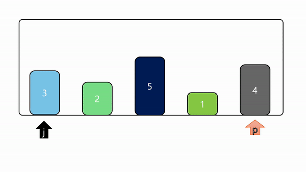
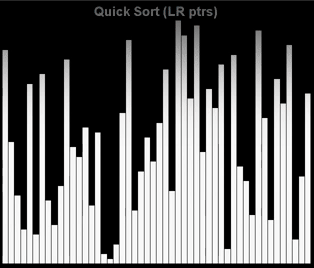
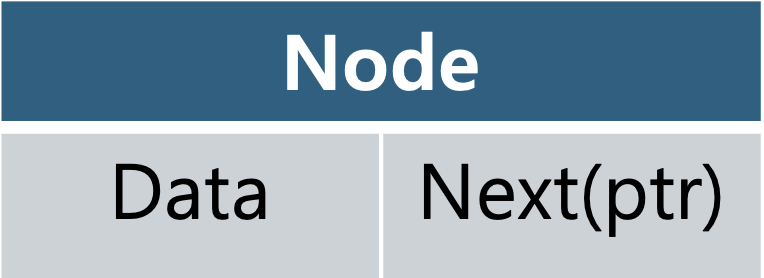

# Quick Sort

```cpp
#include <iostream> 
#include <vector> 
#include <algorithm> //swap

void qsort(std::vector<int>& a, int l, int r) {
    // l >= r, 정렬할 구간이 없으면 함수 종료
    if (l >= r) return;
    
    // 마지막 숫자를 피벗(pivot)으로 선택
    int p = a[r];
    // i는 피벗보다 작은 요소들이 들어갈 위치를 나타냄
    int i = l - 1;
    
    // l부터 r-1까지 반복하면서 피벗보다 작은 요소를 찾음
    for (int j = l; j < r; ++j) {
        if (a[j] < p) {
            // 피벗보다 작은 요소를 찾으면 i를 하나 증가시키고
            // 그 위치에 a[j]를 swap으로 교환함
            std::swap(a[++i], a[j]);
        }
    }
    // 피벗을 중간 위치로 이동
    std::swap(a[++i], a[r]);
    
    // 피벗의 왼쪽과 오른쪽 부분 배열에 대해 재귀적으로 퀵 정렬을 수행
    qsort(a, l, i - 1);
    qsort(a, i + 1, r);
}

int main() {
    // 정렬할 배열 시작점
    std::vector<int> a = {3, 2, 5, 1, 4};
    
    // qsort 함수를 호출하여 배열을 정렬
    qsort(a, 0, a.size() - 1);
    
    // 정렬된 배열을 출력
    for (int x : a) std::cout << x << " ";
    
    return 0;
}

```



20201507 정윤걸 직접 quicksort에 대한 이해 시각화



교수님께서 수업중에 보여주신 자료 
[https://www.youtube.com/watch?v=BeoCbJPuvSE](https://www.youtube.com/watch?v=BeoCbJPuvSE)

퀵 정렬은 분할 정복 기법을 사용하는 매우 효율적인 알고리즘입니다.

작동방식: 

1. 분할
    - 배열에서 피벗(Pivot)이라는 기준값을 정합니다.
    - 피벗을 기준으로 작은 값들은 피벗의 왼쪽, 큰 값들은 피벗의 오른쪽으로 이동한다
2. 정복
    - 피벗을 기준으로 나뉜 왼쪽 부분 배열과 오른쪽 부분 배열에 대해 재귀적으로 퀵정렬을 수행한다
3. 병합
    - 분할된 배열들이 재귀 호출을 통해 정렬되면 이를 합쳐서 전체 배열로 정렬한다.
    
    # Linked List
    
    ```cpp
    #include <iostream> 
    
    // 노드 구조체 정의: 단일 연결 리스트의 각 요소
    struct Node {
        int data; // 노드의 데이터
        Node* next; // 다음 노드를 가리키는 포인터
    
        
        Node(int d) : data(d), next(nullptr) {}// 생성자: 새로운 노드를 만들고, 다음 노드는 nullptr로 설정
    };
    
    // 연결 리스트 클래스 정의
    class LinkedList {
        Node* head; // 리스트의 첫 번째 노드를 가리키는 포인터
    
    public:
        // 생성자: 리스트가 비어있음을 나타내기 위해 head를 nullptr로 초기화
        LinkedList() : head(nullptr) {}
    
        // 새로운 데이터를 리스트에 추가하는 함수
        void add(int d) {
            Node* n = new Node(d); // 새로운 노드를 동적으로 생성
            if (!head) { // 리스트가 비어있다면, 새로운 노드를 head로 설정
                head = n;
            } else {
                Node* t = head; // 임시 포인터 t를 사용하여 리스트의 끝까지 이동
                while (t->next) t = t->next; // t가 마지막 노드를 가리킬 때까지 반복
                t->next = n; // 마지막 노드의 next를 새로운 노드로 설정
            }
        }
    
        // 리스트의 모든 데이터를 출력하는 함수
        void print() {
            Node* t = head; // 임시 포인터 t를 head로 초기화
            while (t) { // t가 nullptr이 아닐 때까지 반복
                std::cout << t->data << " "; // 현재 노드의 데이터를 출력
                t = t->next; // t를 다음 노드로 이동
            }
            std::cout << std::endl; // 출력 형식을 맞추기 위해 줄바꿈
        }
    
        // 소멸자: 리스트의 모든 노드를 삭제하여 메모리 누수를 방지
        ~LinkedList() {
            while (head) { // head가 nullptr이 될 때까지 반복
                Node* t = head; // 임시 포인터 t에 현재 head를 저장
                head = head->next; // head를 다음 노드로 이동
                delete t; // t가 가리키는 노드를 삭제
            }
        }
    };
    
    int main() {
        LinkedList list; // LinkedList 객체 생성
        list.add(1); // 리스트에 1 추가
        list.add(2); // 리스트에 2 추가
        list.add(3); // 리스트에 3 추가
        list.print(); // 리스트 출력: 1 2 3
        return 0; // 프로그램 종료
    }
    
    ```
    
연결리스트: 현재 작성한 코드는 단일 연결 리스트로 각 노드는 데이터와 다음 노드를 기리키는 포인터로 구성
Node: 연결리스트에서 사용되는 하나의 데이터 덩어리, 데이터와 링크 총 2가지의 필드를 담고 있는 구조입니다.


노드= 데이터(d) + 다음 노드를 가리키는 포인터(next)
리스트의 시작 = head
마지막 노드 = nullptr

append(): 새로운 데이터를 리스트 마지막에 새로운 노드로 추가
display(): 연결리스트 순회 하여 각 노드의 데이터를 출력
~LinkedList(): 소멸자를 사용하여 리스트가 소멸될 때 노드의 메모리를 해제 메모리 누수방지




### 소감
정윤걸: 정렬알고리즘이 어떤 것인지 알게 되었고, 그것을 다른 자료들을 시각화 해서 이해를 했기 때문에 시각적인 자료를 만들어 제가 잘 이해 했는지 테스트 해보았습니다.
또한 연결리스트는 기존에 알고 있던 자료구조인데, 이를 c++로 구현해보면서 이런 이론적인 부분도 구현을 할 수 있다는 것을 새삼 깨닫게 되었습니다.
시각화하라는 지시는 없었지만, 다른사람들의 또다른 참고 자료가 되었으면 좋겠다는 생각에 열심히 만들어보았습니다. 감사합니다.


조현래: 이번 시간을 통하여 연결리스트는 동적으로 크기가 변하는 데이터를 처리하는데 유용하고
퀵 정렬은 대량의 데이터를 빠르게 정렬하는것에 유용하다는것을 배웠습니다.

